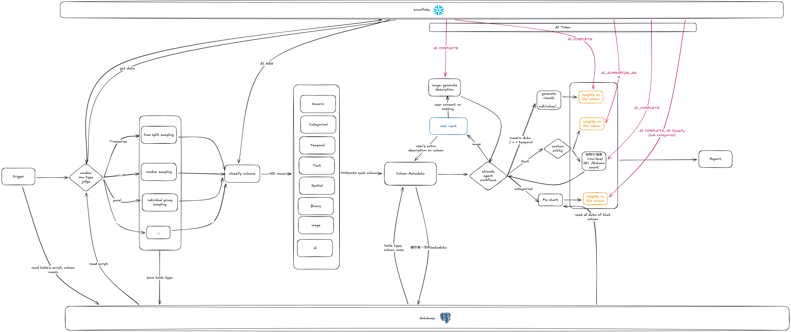

<div align="center">
  

# Scrat — Snowflake Centric Raw Analytics Toolkit

**AI-SQL driven Data Quality as a Service (DQaaS) on Snowflake**

Automated data understanding, quality scanning, and repair workflows powered by Snowflake Cortex AI.

[](https://youtu.be/tSP-viYXWWM)

</div>

## What is Scrat?

Scrat transforms data quality management into an **executable, auditable workflow** using Snowflake's AI-SQL capabilities. Instead of manual data profiling and ad-hoc fixes, Scrat provides:

- **Automated Understanding**: AI agents analyze table structure, column semantics, and relationships
- **Quality Scanning**: Detect completeness, validity, consistency, and uniqueness issues
- **Repair Workflows**: Generate, approve, and execute data fixes with full audit trails
- **Visual Reports**: Comprehensive insights with charts, statistics, and actionable recommendations

### Why Snowflake + AI-SQL?

- **Data stays in place**: No data movement, all processing happens in Snowflake
- **Batch AI operations**: Cortex AI functions work like SQL, enabling large-scale inference
- **Cost transparency**: Token counting and windowed processing for predictable costs
- **Multi-modal support**: Text, images, and structured data in unified workflows

### Datasets

- **Finance**: China A-Shares stock market (1990-2023, ~85K records)
- **Travel**: Flight itineraries and pricing (82M+ records, 29GB)
- **Retail**: Fashion product catalog

## Core Concepts

### Agentic Workflow Architecture

Scrat uses specialized AI agents orchestrated by a central coordinator:

- **Orchestrator Agent**: Analyzes table metadata and routes columns to appropriate specialists
- **Numeric Agent**: Distribution, trends, correlations, outliers, seasonality
- **Categorical Agent**: Frequency, top-K, group comparisons, merge suggestions
- **Text Agent**: Summarization, extraction, semantic analysis via `AI_COMPLETE`
- **Image Agent**: Visual understanding and description generation
- **Data Quality Agent**: Completeness, validity, consistency, uniqueness checks

### Data Quality Pipeline

1. **Understand**: Column typing (numeric/categorical/temporal/text/spatial/id), table structure (time-series/i.i.d./panel)
2. **Scan**: Detect missing values, conflicts, range violations, duplicates
3. **Plan**: Generate repair strategies with impact estimates and SQL
4. **Approve**: Human-in-the-loop gate before execution
5. **Execute**: Write fixes to staging tables with full audit trail
6. **Report**: Comprehensive documentation with visuals and insights

## Quick Start

### Prerequisites

- Python 3.12+
- Node.js 18+
- PostgreSQL 13+ (or use Docker Compose)
- Snowflake account with Cortex AI enabled

### 1. Backend Setup

```bash
cd core
source .venv/bin/activate
uv pip install -r requirements.txt
uv run uvicorn src.app.main:app --reload --host 0.0.0.0 --port 8000
```

API docs: `http://localhost:8000/docs`

### 2. Frontend Setup

```bash
cd frontend
npm install
npm run dev
```

UI: `http://localhost:5173`

### 3. Database Setup

**Option A: Local PostgreSQL**

Set environment variables in `core/src/.env`:

```bash
POSTGRES_USER=postgres
POSTGRES_PASSWORD=postgres
POSTGRES_SERVER=localhost
POSTGRES_PORT=5432
POSTGRES_DB=postgres
```

**Option B: Docker Compose**

```bash
cd core/scripts/local_with_uvicorn
docker compose up -d
```

Includes: PostgreSQL, Redis, FastAPI, and optional worker.

## Snowflake Data Setup

### Create Databases

```bash
cd data
python snowflake_setup.py --warehouse AI_SQL_COMP --database FINANCE_DB
python snowflake_setup.py --warehouse AI_SQL_COMP --database TRAVEL_DB
python snowflake_setup.py --warehouse AI_SQL_COMP --database RETAIL_DB
```

### Upload Datasets

```bash
# Finance: China A-Shares (~85K rows)
python upload_china_stocks.py

# Retail: Fashion products
python universal_uploader.py --file dataset/scraped_data_2025-08-28/stylesourcebook_2025-08-28_26bf9c34_INDEX.json \
  --database RETAIL_DB --table FASHION_PRODUCTS --if-exists replace

# Travel: Flight itineraries (29GB, 82M rows)
python upload_large_csv.py
```

### Verify

```bash
python -c "
import snowflake.connector, configparser
config = configparser.ConfigParser()
config.read('snowflake_config.ini')
p = dict(config['andy_new_account'])
conn = snowflake.connector.connect(user=p['user'], password=p['password'],
    account=p['account'], warehouse='AI_SQL_COMP', role='ACCOUNTADMIN')
cursor = conn.cursor()
for db, table in [('FINANCE_DB', 'CHINA_A_SHARES_STOCK_DATA'),
                   ('TRAVEL_DB', 'FLIGHT_ITINERARIES'),
                   ('RETAIL_DB', 'FASHION_PRODUCTS')]:
    cursor.execute(f'USE DATABASE {db}')
    result = cursor.execute(f'SELECT COUNT(*) FROM {table}').fetchone()
    print(f'{db}.{table}: {result[0]:,} rows')
"
```

## Architecture



### System Components

```
┌─────────────────────────────────────────────────────────┐
│ Frontend (React + Flowgram)                             │
│  • Workflow visualization & execution                   │
│  • Approval gates & audit trails                        │
│  • Reports with charts & insights                       │
└────────────────┬────────────────────────────────────────┘
                 │ REST/WebSocket
┌────────────────┴────────────────────────────────────────┐
│ Core API (FastAPI)                                      │
│  • Agentic workflow orchestration                       │
│  • AI-SQL function wrappers                             │
│  • Quality scanning & repair planning                   │
└────┬──────────────┬──────────────────┬──────────────────┘
     │              │                  │
┌────┴─────┐  ┌────┴──────┐  ┌────────┴────────┐
│Snowflake │  │PostgreSQL │  │Redis            │
│• Data    │  │• Metadata │  │• Cache          │
│• AI-SQL  │  │• Workflows│  │• Rate limiting  │
└──────────┘  └───────────┘  └─────────────────┘
```

### Key Services

- **SnowflakeService**: Connection pooling, query execution, AI-SQL wrappers
- **AISQLService**: All Cortex AI functions (COMPLETE, CLASSIFY, FILTER, AGG, etc.)
- **EDAService**: Statistical analysis, distribution profiling, correlation
- **ChartService**: Visualization generation (histograms, scatter, time-series)
- **WorkflowService**: Agent orchestration, state management, approval gates

## API Reference

Full API documentation: `http://localhost:8000/docs`

### Core AI-SQL Endpoints

All Snowflake Cortex AI functions available at `/api/v1/ai-sql/`:

| Endpoint | Function | Use Case |
|----------|----------|----------|
| `/complete` | AI_COMPLETE | Text generation, Q&A, multi-modal understanding |
| `/classify` | AI_CLASSIFY | Multi-label classification |
| `/filter` | AI_FILTER | Intelligent row filtering |
| `/aggregate` | AI_AGG | Semantic aggregation |
| `/sentiment` | AI_SENTIMENT | Sentiment analysis |
| `/summarize` | SUMMARIZE | Text summarization |
| `/semantic-join` | - | AI-powered table joining |
| `/extract-structured` | - | Structured data extraction |
| `/transcribe` | AI_TRANSCRIBE | Audio to text |

### Example: Stock Classification

```python
import requests

response = requests.post("http://localhost:8000/api/v1/ai-sql/classify", json={
    "content_column": "INDUSTRY_CATEGORY",
    "categories": ["Technology", "Finance", "Manufacturing"],
    "table_name": "FINANCE_DB.PUBLIC.CHINA_A_SHARES_STOCK_DATA"
})
```

## Project Structure

```
sf_aisql_innovation_challenge/
├── frontend/                    # React + Vite UI
│   ├── src/
│   │   ├── components/         # Flowgram, Reports, Boards
│   │   ├── services/           # API clients
│   │   └── pages/              # Main views
│   └── public/
├── core/                        # FastAPI backend
│   ├── src/app/
│   │   ├── api/v1/             # REST endpoints
│   │   │   ├── ai_sql.py       # AI-SQL wrappers
│   │   │   ├── workflow.py     # Agent orchestration
│   │   │   └── quality.py      # DQ scanning & repair
│   │   ├── services/           # Business logic
│   │   │   ├── ai_sql_service.py
│   │   │   ├── snowflake_service.py
│   │   │   ├── eda_service.py
│   │   │   └── workflow_service.py
│   │   ├── schemas/            # Pydantic models
│   │   └── core/               # Config & utilities
│   └── tests/                  # Test suite
├── data/                        # Data management
│   ├── dataset/                # Raw datasets
│   ├── snowflake_setup.py      # DB creation
│   ├── universal_uploader.py   # CSV/JSON/Excel uploader
│   └── upload_large_csv.py     # Chunked upload for large files
├── refs/                        # Research papers
└── examples/                    # Snowflake AI-SQL examples
```

## Testing

```bash
cd core
pytest tests/ -v                 # Run all tests
pytest tests/test_ai_sql.py -v   # Test AI-SQL endpoints
pytest tests/test_workflow.py -v # Test agent workflows
```

## Configuration

Edit `core/src/app/core/config.py` or set environment variables:

```bash
# Snowflake
SNOWFLAKE_ACCOUNT=your_account
SNOWFLAKE_USER=your_user
SNOWFLAKE_PASSWORD=your_password
SNOWFLAKE_WAREHOUSE=AI_SQL_COMP
SNOWFLAKE_ROLE=ACCOUNTADMIN

# PostgreSQL
POSTGRES_USER=postgres
POSTGRES_PASSWORD=postgres
POSTGRES_SERVER=localhost
POSTGRES_PORT=5432
POSTGRES_DB=postgres
```

## Key Features

✅ **Agentic Workflows**: Orchestrated AI agents for automated data understanding
✅ **Data Quality as a Service**: Scan → Plan → Approve → Execute → Report
✅ **Cost Transparency**: Token counting and windowed processing
✅ **Audit Trails**: Full lineage for all quality fixes
✅ **Multi-Modal Support**: Text, images, structured data
✅ **Production-Ready**: Rate limiting, caching, async processing
✅ **Comprehensive AI-SQL**: All Cortex functions wrapped as REST APIs

## Academic Foundation

Scrat's design is grounded in data quality research:

- **Consistency-first approach** (VLDB 2007): Validate constraints before accuracy checks
- **Multi-tool detection** (Detecting Data Errors): Combine multiple quality checks for better coverage
- **DQaaS architecture**: Composable, reusable quality services with central orchestration
- **Human-in-the-loop**: Approval gates prevent automated errors (Barchard 2011)

## License

MIT
